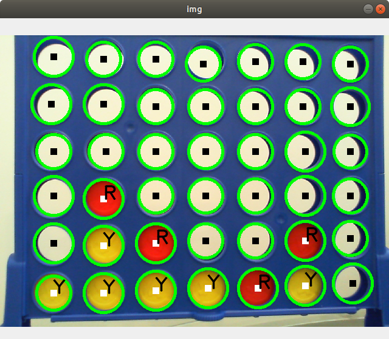

# Connect4-UR
UR5 Robot playing Connect 4

This project is a demo presented by [COROM](https://corom.ca/en/) and [Robotique UdeS](https://robotiqueudes.ca/) of a UR5 Robot playing connect 4 againt a user. This repository contains all the code and parts to setup the demo. A video can be found on COROM's [youtube channel](https://www.youtube.com/channel/UCWvofj-kaz6MWmn6LcGPxmg/videos)


## Mechanical Setup
Here is the list of used materials:
- UR5 Robot
- Robotiq's [gripper](https://robotiq.com/fr/produits/main-adaptative-a-2-doigts-2f85-140)
- Vention rolling cart
- Connect 4 game
- USB Camera (Microsoft HD-3000)
- 3D Printed parts
- Plank of wood to fix everything  

The UR Robot is fixed on the Vention cart. The plank of wood is also fixed to the cart using parts 01-fix and 02-fix.
The camera is also fixed to the cart using part 03-camera-support.
Finally, the game and the chip distributor are bolted to the wooden plank. Part 04-game-funnel makes it easier for the robot to insert chips in the game when playing. The chip distributor is composed of parts 05-base, 06-chip-funnel and plexiglass parts 07-pannel and 08-supports.

## Code

All you need to run the code is a python environment with opencv and ur-rtde library. Then, you can connect to the UR via Ethernet. You will need to set a static IP adress on the UR that is on the same network as the controlling PC.

```bash
pip install -r requirements.txt
```

### Board detection
The board is detected using opencv. First, circles are detected using HoughCircles. Then, we check that all of the circles from the board are detected and we check what color they are. The board is return in a matrix format that is compatible with the game algorithm.




### Game algorithm
The algorithm from https://github.com/ForrestKnight/ConnectFour is used. It receives the board state from the board detection algorithm and outputs the robot's move.

### UR
Using the library UR-RTDE, a python script activates and deactivates the UR's I/Os to communicate in which column the robot should play. Trajectories to each column and to the chip distributor were teached. The correct trajectory starts when the corresponding I/O is activated by the python script. Each column is associated with its own trajectory and trajectories are saved as subprograms. The main program running on the UR constantly checks the values of the robot's I/O's and calls the appropriate subprogram. The I/O's are mapped so that the digital output 1 triggers the leftmost column from the camera's persepective and so on. 

### Referential
Every waypoint inside the robot's trajectories is taught relative to a feature (referential) point of the UR. This way, if the mecanical setup needs to change, you will only need to reteach the feature point to the UR and the trajectories will remain valid. By default, this point is teached in the bottom left corner of the playing surface (from the robot's perspective).


